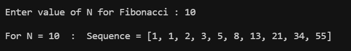
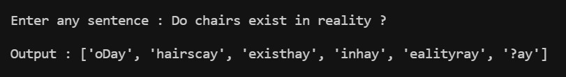
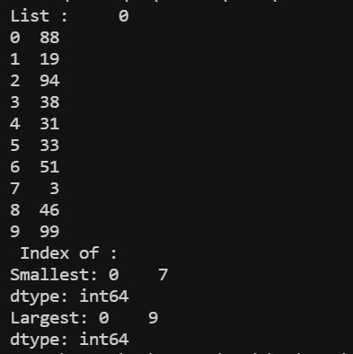
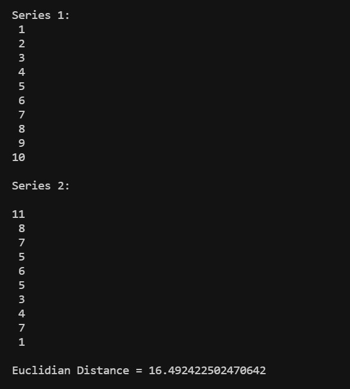
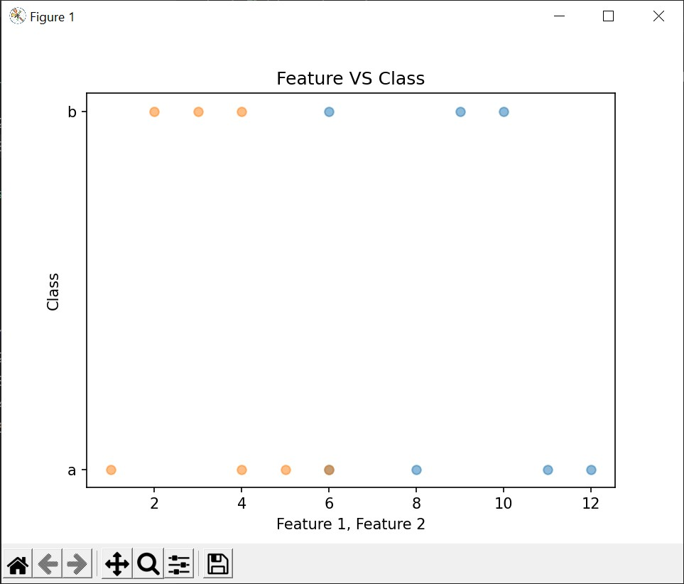

# Lab Journal 2
> ## [Task 1](lab_2_task_1.py)
> **ScreenShot:**      
> ## [Task 2](lab_2_task_2.py)
> **ScreenShot:**     
> ## [Task 3](lab_2_task_3.py)
> **ScreenShot:**     
> ## [Task 4](lab_2_task_4.py)
> **ScreenShot:**     
> ## [Task 5](lab_2_task_5.py)
> **ScreenShot:**     

 

**[Goto Home](../README.md)**